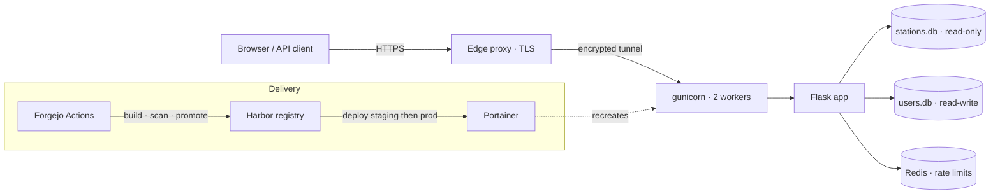

# Signal-Scout

Polish cellular base-station coverage as a queryable map and REST API.
Live at **[signal-scout.com](https://signal-scout.com)** — ingests the official
UKE permit dataset monthly and serves ~188k stations across all four PL
operators, on a self-hosted stack for ~€7/month.

|                |                                                                    |
|----------------|--------------------------------------------------------------------|
| Live app       | https://signal-scout.com · API docs at `/api/v1/docs/`             |
| Data           | UKE base-station permits, ~188k rows, refreshed monthly            |
| Operators      | Orange, Play, Plus, T-Mobile                                        |
| Stack          | Flask · SQLAlchemy · SQLite · gunicorn · Leaflet · Tailwind        |
| Delivery       | Forgejo Actions → Harbor → Portainer, self-hosted (Hetzner edge + Tailscale) |
| Tests          | 69 test files · 666 collected · 75% coverage gate in CI            |

> This is a curated public mirror of a private repo: the app, tests, CI/CD
> and infra manifests ship; the raw-data ingestion pipeline, ops runbooks and
> internal topology do not. Infra hostnames appear as `example.local`
> placeholders by design.

## What it does

- **Click anywhere in Poland** → the base stations within range, grouped by
  operator and frequency band, with distance and a modelled signal tier.
- **REST API** at `/api/v1/*` — OpenAPI spec at `/api/v1/openapi.json`,
  Swagger UI at `/api/v1/docs/`, per-tier rate limits.
- **Saved locations** with monthly email alerts when coverage materially
  changes at an address (address search, GPS, or a map pin).
- **Public `/stats`** — operator share by generation, the 5G site race, and
  month-over-month deltas across the monthly snapshots.

```bash
curl 'https://signal-scout.com/api/v1/stations?lat=52.2297&lng=21.0122&limit=3' \
  -H 'Referer: https://signal-scout.com/'
```

Returns the three nearest stations to the centre of Warsaw with operator and
frequency-band metadata.

## Architecture



Two SQLite binds: `stations.db` is baked read-only into the image and rebuilt
monthly from UKE; `users.db` is a read-write persistent volume holding
accounts, saved locations and (Fernet-wrapped) 2FA seeds. The edge node holds
the public certificate; the app host has no inbound public exposure and is
reachable only across the mesh tunnel.

## Performance

The hot path — map click → station list — was rebuilt from Python-side row
grouping into a single SQL `GROUP_CONCAT` query plus a composite index
`ix_segment_provider_band(latitude_segment, service_provider, frequency_band)`,
turning a full-table scan + Python aggregation into one index scan with no temp
sort.

| Benchmark (100 req, prod-size 188k-row DB)    | Before   | After   | Δ p95 |
|-----------------------------------------------|----------|---------|-------|
| `GET /stations` p95                           | 98 ms    | 20 ms   | −80%  |
| Mixed endpoint suite p95                      | 185.6 ms | 48.0 ms | −74%  |
| Home page p95 (per-PR CI gate, 500 ms budget) | —        | 2.9 ms  | —     |

A key move before the SQL rewrite: **latitude segmentation** — a
`latitude_segment = floor((lat − 49.0) / 0.1)` indexed column narrows each
query to three adjacent 11 km bands (~0.3% of the table) before haversine runs.
Benchmark runs are committed under `tests/results/`.

## Engineering highlights

- **Auth** — Authlib multi-provider OAuth (Google/GitHub) + email/password,
  pyotp TOTP 2FA, bcrypt, session-epoch invalidation (password change logs out
  everywhere), password step-up on sensitive actions.
- **Security** — Fernet envelope-encryption for at-rest 2FA seeds
  (HKDF-derived key, pluggable to a cloud HSM), prefix-indexed hashed API keys,
  per-route CSP, CSRF with rotation on auth events, account lockout, GDPR
  Art. 13/17 endpoints, RFC 8058 one-click unsubscribe, ECDSA-verified SendGrid
  event webhook.
- **Observability** — `prometheus-client` in multiprocess mode covering the
  four golden signals + SLO error budgets; `/metrics` behind bearer auth.
- **Delivery** — 10-job Forgejo pipeline: lint (ruff/bandit/pip-audit) → tests
  (75% gate) → Trivy fs+image scan → build/push → digest promotion → deploy
  staging then prod, each with a version-asserting smoke gate and a
  Harbor-independent rollback.
- **Deployment** — multi-stage Dockerfile, non-root `appuser`, tini PID 1,
  `HEALTHCHECK`, Alembic migrations at boot, CalVer + git-SHA versioning.

## Quick start

```bash
git clone https://github.com/hch155/signal-scout.git
cd signal-scout
python3 -m venv venv && source venv/bin/activate
pip install -r requirements.txt
cd src && python app.py          # http://localhost:8080
```

Or run the container: `docker build -t signal-scout . && docker run -p 8080:8080 signal-scout`.
The built `stations.db` ships in the repo, so a fresh clone runs with real data.

## Known limitations

- **SQLite, not Postgres.** Comfortable at this scale (read-heavy, single
  monthly writer) and keeps deploy to one image + one volume. Because the
  writable `users.db` is single-writer, the web tier runs one replica; a
  Postgres move is the prerequisite for horizontal scaling and is deferred
  until load demands it.
- **Monthly data freshness.** UKE publishes once a month, so a query is at most
  ~30 days stale — acceptable for drive-test planning and site selection.
- **Coverage is modelled, not measured.** Signal tiers derive from transmitter
  location and RF path-loss, not field measurements — an estimate, not a
  guarantee. Poland only, limited to operators/bands in the UKE registry.

## License

Licensed under the [GNU AGPL-3.0](LICENSE) © 2026 Hubert Cylwik. Network use is
distribution: if you run a modified version as a service, you must offer its
source under the same license.

## Contact

Hubert Cylwik · [signal-scout.com](https://signal-scout.com) ·
[LinkedIn](https://www.linkedin.com/in/hcylwik/) · hcylwik@gmail.com
